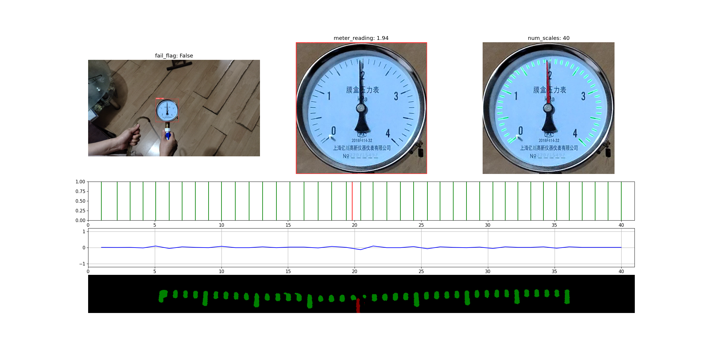

# 基于yolov5和deeplabv3plus的表针读数

## 1.基本工作流

~~~flow
s1=>inputoutput: 输入源(图片,视频或摄像头)
s2=>operation: yolov5 目标识别算法
s3=>operation: 含有表盘的bounding box
s4=>operation: deeplabv3+语义分割算法
s5=>operation: 语义分割结果(刻度和指针)
s6=>operation: 图像后处理
e=>end: 表针读数

s1->s2->s3->s4->s5->s6->e
~~~

## 2.源码结构

~~~shell

├── datasets # 数据集
│   ├── meter_deep # deeplabv3+ 数据集
│   └── meter_yolo # yolov5 数据集
├── deeplabv3plus  # deeplabv3+ 目录
│   ├── checkpoints # 模型记录点
│   ├── data_enhance.py # 数据增强
│   ├── __init__.py
│   ├── labelme2voc.py # labelme标注数据转voc数据集
│   ├── labels.txt # labelme2voc.py 需要用的文件
│   ├── predict.py # 语义分割预测
│   ├── split_dataset.py # 划分voc数据集的训练集和验证集
│   ├── trained_model # 手动保存的模型记录点
│   ├── train_segmentation.py # 语义分割训练
│   └── voc2paddle.py # voc数据集转paddle数据集
├── yolov5 # yolov5 主目录
│   ├── checkpoints
│   ├── data
│   ├── detect_meter.py
│   ├── export.py
│   ├── __init__.py
│   ├── models
│   ├── paddle2yolo.py
│   ├── convertLabelmeToYolov5.py
│   ├── requirements.txt
│   ├── runs
│   ├── train.py # 目标识别训练
│   ├── utils
│   ├── val.py
│   ├── yolov5l.pt
│   ├── yolov5m.pt
│   ├── yolov5s.pt
│   └── yolov5x.pt
├── predict.py # 使用yolov5和deeplabv3+识别表针
├── train_detect.py # 训练yolov5
├── train_segmentation_water.py # 训练识别水位的deeplabv3+
└──train_segmentation.py # 训练deeplabv3+

~~~

## 3.数据集

目标检测数据集: 使用labelme对图片进行标注, 用convertLabelmeToYolov5.py 转为 yolov5 所需的数据集格式.

语义分割数据集: 使用labelme对图片进行标注, 用labelme2voc.py 转为 voc 格式.

## 4.算法可视化

yolov5 目标识别 (第一行第一列的图)

-> 含有表盘的bounding box(第一行第二列的图) 

-> 将bounding box resize 为 (512, 512), 认为表盘圆心在 (256, 256) 

->  deeplabv3+语义分割 

-> 语义分割结果(第一行第三列的图) 

-> 以(256, 256)为圆心, 将圆形表盘变换为矩形表盘 (第四行的图, 具体变换算法在read_number/read_number.py)

-> 从矩形表盘上定位刻度和指针 (第二行的图, 具体算法在read_number/read_number.py)

-> 对刻度位置进行校正, 用到了刻度坐标的二阶差分值 (第三行的图)

-> 根据刻度和指针的相对位置读数

